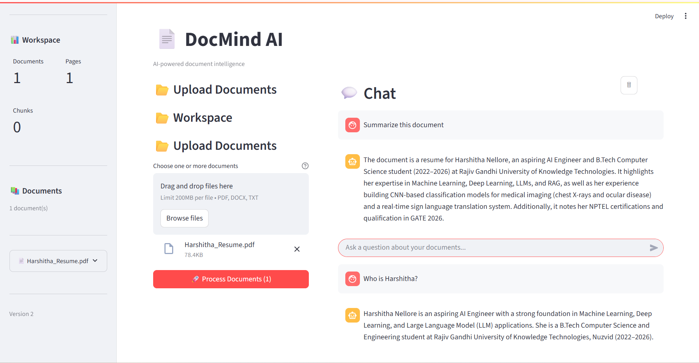
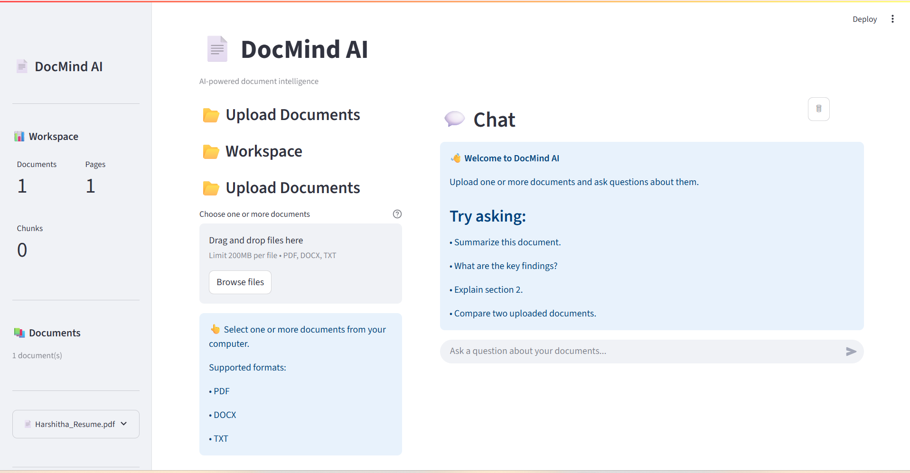
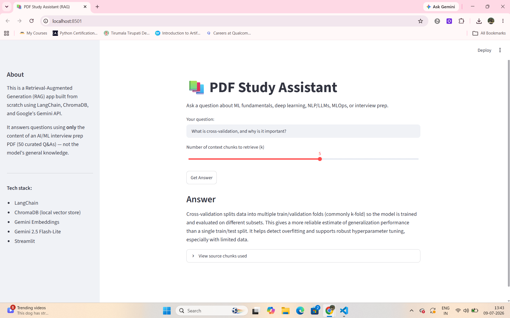

# 📄 DocMind AI

> **An AI-powered document intelligence platform built with Retrieval-Augmented Generation (RAG), Google Gemini, ChromaDB, and Streamlit.**

DocMind AI enables users to upload documents, build a searchable knowledge base, and interact with them through natural language conversations. It combines modern RAG architecture with semantic search to deliver context-aware, grounded responses.

---

## ✨ Features

### 📂 Document Management
- Upload PDF, DOCX, and TXT documents
- Automatic document validation
- Secure file storage with SHA-256 hashing
- Metadata management
- Document library with status tracking
- Delete documents (removes metadata, files, and embeddings)

### 📖 Document Processing
- PDF text extraction
- DOCX parsing
- TXT processing
- Automatic page detection
- Structured metadata generation

### 🧩 Intelligent Chunking
- Recursive text chunking
- Configurable chunk size
- Configurable overlap
- Metadata preservation
- Page-aware chunking

### 🧠 AI & Retrieval
- Google Gemini Embeddings
- ChromaDB vector database
- Semantic similarity search
- Retrieval-Augmented Generation (RAG)
- Context-aware prompt construction
- Streaming AI responses

### 💬 Conversational Interface
- Chat with uploaded documents
- Multi-turn conversation
- Streaming responses
- Source citations
- Session history
- Clear conversation support

### 🎨 Modern UI
- Responsive Streamlit interface
- Workspace dashboard
- Document statistics
- Professional sidebar
- Upload progress
- Toast notifications

---

# 🏗️ Architecture

```text
                        User
                          │
                          ▼
                  Streamlit Interface
                          │
                          ▼
                  Service Container
                          │
        ┌─────────────────┴─────────────────┐
        ▼                                   ▼
Document Manager                    RAG Pipeline
        │                                   │
        ▼                                   ▼
 File Manager                      Retriever
        │                                   │
 Metadata Repository            Prompt Builder
        │                                   │
        ▼                                   ▼
 Document Processor           Gemini Chat Model
        │
        ▼
 Chunker
        │
        ▼
 Gemini Embeddings
        │
        ▼
 ChromaDB Vector Store
```

---

# 📁 Project Structure

```text
DocMind AI/
│
├── app.py
├── config/
├── managers/
├── models/
├── processors/
├── rag/
├── repositories/
├── services/
├── ui/
├── utils/
├── tests/
├── data/
│   ├── uploads/
│   └── metadata.json
│
├── requirements.txt
├── pyproject.toml
└── README.md
```

---

# ⚙️ Tech Stack

## Backend

- Python 3.12
- Streamlit
- Google Gemini API
- ChromaDB
- Pydantic v2
- UV Package Manager

## AI

- Gemini 2.5
- Gemini Embeddings
- Retrieval-Augmented Generation (RAG)

## Storage

- Local File System
- JSON Metadata Repository
- ChromaDB Vector Database

---

# 🚀 Installation

Clone the repository:

```bash
git clone https://github.com/<YOUR_USERNAME>/DocMind-AI.git
cd DocMind-AI
```

Install dependencies:

```bash
uv sync
```

Create a `.env` file:

```env
GOOGLE_API_KEY=your_api_key

GEMINI_MODEL=your_model

EMBEDDING_MODEL=your_embedding_model
```

Run the application:

```bash
uv run streamlit run app.py
```

---

# 📚 Usage

### 1. Upload Documents

Supported formats:

- PDF
- DOCX
- TXT

---

### 2. Process Documents

DocMind AI automatically:

- validates the document
- extracts text
- chunks the content
- generates embeddings
- stores vectors in ChromaDB

---

### 3. Ask Questions

Example prompts:

```
Summarize this document.

What are the key findings?

Explain chapter 3.

Compare the uploaded documents.

What conclusions does the author make?
```

---

# 🔍 Retrieval Pipeline

```text
Question
    │
    ▼
Retriever
    │
    ▼
Relevant Chunks
    │
    ▼
Prompt Builder
    │
    ▼
Gemini
    │
    ▼
Answer + Sources
```

---

# 📊 Current Capabilities

| Feature | Status |
|----------|:------:|
| PDF Processing | ✅ |
| DOCX Processing | ✅ |
| TXT Processing | ✅ |
| Semantic Search | ✅ |
| Streaming Responses | ✅ |
| ChromaDB Integration | ✅ |
| Gemini Embeddings | ✅ |
| RAG Pipeline | ✅ |
| Document Management | ✅ |
| Workspace Dashboard | ✅ |
| Source Citations | ✅ |

---

# 🧪 Running Tests

Run all tests:

```bash
uv run pytest
```

Or execute individual test modules:

```bash
uv run python -m tests.test_pipeline
```

```bash
uv run python -m tests.test_chunker
```

```bash
uv run python -m tests.test_retriever
```

```bash
uv run python -m tests.test_llm
```

---

# 🔮 Future Enhancements

- OCR support for scanned PDFs
- Image understanding
- Multi-document comparison
- Hybrid search (BM25 + Vector Search)
- Re-ranking models
- Conversation persistence
- User authentication
- Cloud storage support
- Docker deployment
- REST API
- Multi-user workspaces

---

# 🎥 Project Demo

Watch the complete demo here:

👉 https://drive.google.com/file/d/1x4s3240Dm-OzNt9ixGMDqvqVpYupheqJ/view?usp=sharing

# 📸 Screenshots


## Workspace



## Chat


```

---

# 🚀 Evolution of DocMind AI

## Version Comparison

| Version 1 | Version 2 |
|-----------|-----------|
|  |  |

### What's New in Version 2

- ✅ Modular architecture
- ✅ Retrieval-Augmented Generation (RAG)
- ✅ ChromaDB vector search
- ✅ Google Gemini integration
- ✅ Streaming AI responses
- ✅ Document management
- ✅ Source citations
- ✅ Professional Streamlit UI
- ✅ Service container architecture

## 📈 Version Evolution

| Feature | Version 1 | Version 2 |
|---------|:---------:|:---------:|
| PDF Upload | ✅ | ✅ |
| Document Management | ❌ | ✅ |
| Semantic Search | ❌ | ✅ |
| RAG Pipeline | ❌ | ✅ |
| Gemini AI | Basic | Advanced |
| Streaming Responses | ❌ | ✅ |
| Source Citations | ❌ | ✅ |
| Modular Architecture | ❌ | ✅ |
| ChromaDB | ❌ | ✅ |
| Clean UI | Basic | Professional |


# 👩‍💻 Author

**Harshitha N**

- Python Developer
- AI / Machine Learning Enthusiast
- Deep Learning & RAG Systems

GitHub:
```
https://github.com/HarshithaNellore
```

LinkedIn:
```
https://linkedin.com/in/harshithanellore
```

---

# 📄 License

This project is licensed under the MIT License.

---

# ⭐ If you found this project useful

Please consider giving it a ⭐ on GitHub.